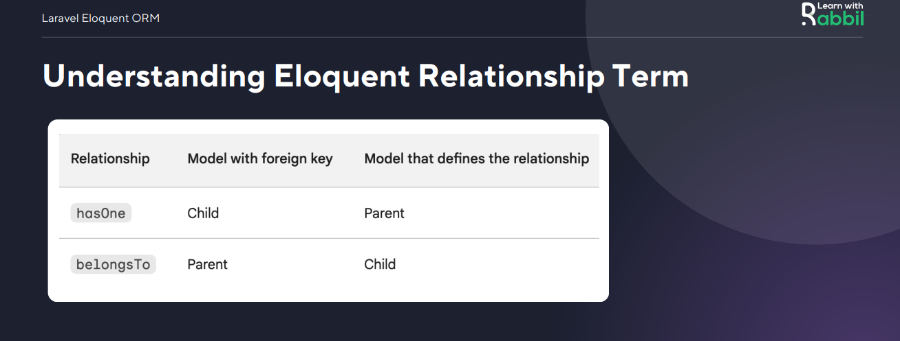

<p align="center"><a href="https://laravel.com" target="_blank"></a></p>

### Laravel Module - 18

#### Meet Eloquent ORM
   
1. Eloquent is an object-relational mapper (ORM)
2. Eloquent models represent database tables.
3. Models can be used to perform operations on data
4. Eloquent also supports relationships between models
5. It provides layer between application and database


### Why we write fillable inside model
   - There are a few reasons why you might want to use the fillable property in Laravel

1. Security: It helps protect your application from mass assignment attacks.
2. Performance: It can improve the performance of your application by reducing the number of fields that need to be checked when mass assigning data.
3. Readability: It makes your code more readable by explicitly defining which fields can be mass assigned.
4. Consistency: It ensures that all of your models have the same set of fillable fields, which can make your code more consistent.
5. Extensibility: It allows you to easily add or remove fillable fields as your application evolves.
   

### Naming Convention = 01

 1. Table name: brands Model name: Brand
 2. Table name: product_details Model name: ProductDetails
 3. If we follow this convention no need to define table name inside model. Other wise we need to define.


```bash
    class Flight extends Model{
        protected $table = 'my_flights';
    }
        
```

### Naming Convention = 02

1. Model assume that corresponding database table has a primary key column named id.
2. Eloquent assumes that the primary key is an incrementing integer value
3. If necessary, you may define a protected $primaryKey property

 ```bash
    class Flight extends Model{
        protected $primaryKey = 'flight_id';
    }     
```      

```bash

    public $incrementing = false;   

```    

```bash

    protected $keyType = 'string'; 

```    
### Naming Convention = 03

1. Model expects created_at and updated_at columns exist on corresponding database table.
2. Eloquent will automatically set these column's values when models are created or updated.
3. If you do not want timestamp automatically managed by Eloquent, you should define a $timestamps property false.

```bash
    class Flight extends Model{
        protected $timestamps = false;
    } 
```
### Naming Convention = 04

1. By default model instance will not contain any attribute values.
2. But you can define an $attributes property on your model as you want.

```bash
    class Brand extends Model{
        protected $attributes =[
            "brandName" => 'default name',
            "brandImg"  => 'default img',
        ]
    }

```
### Retrieving All Rows

```bash
    public function getBrandName(Request $request) {
        return Brand::get();
    }
     public function getBrandName(Request $request) {
        return Brand::all();
    }

```
### Retrieving Single  Rows


```bash

    public function firstData(Request $request) {
        return Brand::first();
    }
    public function findData(Request $request) {
        return Brand::find(3);
    }

```
### Select Clause 
1. The select() method allows you to specify the columns
2. To return distinct results use the distinct() method


```bash
    public function ProductTitle(Request $request) {
        return Product::select('title', 'price', 'discount_price')->get();
    }
    function UniquePrice(Request $request) {
        return Product::select('price')->distinct()->get();
    }

```

### Paginate

Display simple "Next" and "Previous"
links in your application's UI, use the
simplePaginate method to perform a
single, efficient query

```bash
    public function DemoAction(){
        return Product::simplePaginate(2)
    }
```
```bash
    public function DemoAction(){
        return Product::paginate(2)
    }
```
```bash
    public function DemoAction(){
        return Product::paginate(
            $perPage  = 5,
            $columns  = ['*'],
            $pageName = 'pageName'
        );
    }
```
### Understanding Eloquent Relationship Term

- Has Relationship:
1. It indicates that one model "has" one or more related models.
2. The model that defines the relationship has the foreign key column. This means that the model that defines the relationship is the "parent" model, and the model that is related to it is the "child" model.

- Belongs Relationship:
1. The "belongs" relationship, also known as the "inverse" relationship, defines the inverse of a "has" relationship
2. This means that the model that is related to the other model is the "parent" model, and the model that defines the
relationship is the "child" model



